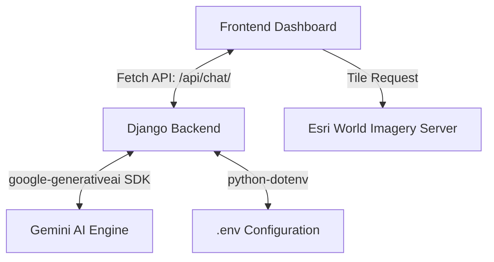

# 🍛 Rasoi Safar (Kitchen Journey)
> **AI-Powered Culinary Tour Guide & Taste Cartographer of India**

**Rasoi Safar** is an interactive, premium web application that acts as a culinary chatbot and geographical locator for the rich, diverse famous foods of India. It features a beautiful responsive split-screen dashboard where users can query regional foods, recipes, and origins, and immediately view coordinates, historical sites, and legendary messes plotted dynamically on an interactive satellite map.

---

## 🌟 Key Features

*   **🤖 AI Culinary Assistant**: Powered by **Google Gemini API** (`gemini-2.5-flash`), providing rich, conversational history, recipes, and taste profiles of Indian foods.
*   **🛰️ Satellite Taste Geography**: Dynamic full-screen **Esri Satellite Map** with place label overlays. Panning and flying camera effects highlight food coordinates.
*   **🛡️ Resilient Local Fallback & Salem Guide**: Includes a smart database mode for offline/quota-exceeded scenarios (429 errors). Built-in custom culinary maps for **Salem** street food outlets (Thattu Vadai Settu) and non-veg messes (**Selvi Mess**).
*   **🎨 Premium Glassmorphic UI**: Sleek dark dashboard with HSL food-saffron theme, Outfit typography, glowing suggestion chips, animated custom scrollbars, and pulsing loading indicators.

---

## 🛠️ Technology Stack

*   **Backend**: Python 3.11, Django Framework, `google-generativeai` SDK, `python-dotenv`
*   **Frontend**: HTML5, Vanilla CSS3 (custom CSS variables & keyframe animations), ES6+ JavaScript
*   **Maps & Rendering**: Leaflet.js (loaded via CDN, no API key required), Esri World Imagery tileset, Marked.js (for markdown chat parsing)
*   **Database**: SQLite (local storage)

---

## 📐 Application Architecture



---

## 📂 File Directory Structure

```
chatbot/
├── .env                  # API Keys and Django secrets
├── .gitignore            # Excludes env, venv, and local database files
├── requirements.txt      # Python dependencies
├── manage.py             # Django runner script
├── food_assistant/       # Django Project Config
│   ├── settings.py       # Configuration and .env loading
│   └── urls.py           # Core URL routers
└── assistant/            # Chatbot Application
    ├── services/
    │   └── gemini.py     # Gemini client and Salem local registry fallbacks
    ├── views.py          # API & index views
    ├── templates/
    │   └── index.html    # Glassmorphism HTML layout
    └── static/
        ├── css/
        │   └── styles.css # Styling (HSL Saffron/Gold, scrollbars, leaflet popups)
        └── js/
            └── app.js     # Chat controller & Leaflet satellite map logic
```

---

## 🚀 Getting Started

### 📋 Prerequisites
- Python 3.11 or higher
- Git installed on your local machine
- A valid Gemini API Key from Google AI Studio (starts with `AIzaSy`)

### 🔧 Installation & Setup

1. **Clone the repository**:
   ```bash
   git clone https://github.com/Subash-M-AI/chatbot.git
   cd chatbot
   ```

2. **Set up a Virtual Environment**:
   ```bash
   python -m venv .venv
   # Activate on Windows:
   .venv\Scripts\activate
   # Activate on macOS/Linux:
   source .venv/bin/activate
   ```

3. **Install Dependencies**:
   ```bash
   pip install -r requirements.txt
   ```

4. **Configure Secrets**:
   Create a `.env` file in the root folder (or modify the existing placeholder):
   ```env
   # Make sure the API key starts with 'AIzaSy' from Google AI Studio
   GEMINI_API_KEY=AIzaSy...
   SECRET_KEY=django-insecure-key-for-food-assistant-chatbot-2026
   DEBUG=True
   ALLOWED_HOSTS=localhost,127.0.0.1
   ```

5. **Apply Database Migrations**:
   ```bash
   python manage.py migrate
   ```

6. **Start the Development Server**:
   ```bash
   python manage.py runserver
   ```

7. **Launch the App**:
   Navigate to [http://127.0.0.1:8000/](http://127.0.0.1:8000/) in your web browser.

---

## 🍽️ Sample Queries to Try

- **Salem Street Food**: *"salem famous food shops"* (reveals Selvi Mess and Settu Shop locations on the satellite map).
- **Biryani Hub**: *"Tell me about Hyderabadi Biryani"* (pans map to Charminar and Paradise Biryani).
- **Vada Pav origin**: *"Explain Mumbai Vada Pav history"* (flies map to Dadar Station, Mumbai).
- **Spongy Sweets**: *"What is Bengali Rosogolla?"* (zooms map to Bagbazar, Kolkata sweet shop).

---

## 📄 License
This project is open-source and available under the [MIT License](LICENSE). Made with ❤️ for Indian food lovers.
